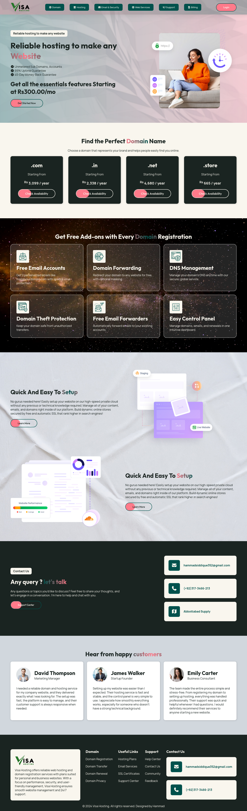

# Visa Hosting 🌐

A modern and responsive web hosting website designed for individuals and businesses.
Built with pure HTML, CSS — no frameworks used.

## 🔴 Live Preview
> Open `index.html` in your browser

---

## 📸 Screenshots




---

## 🚀 Features

- Responsive design for all screen sizes
- Domain registration section (.com, .in, .net, .store)
- Free Add-ons section (Email, DNS, Control Panel)
- Quick & Easy Setup section
- Testimonials from happy customers
- Contact Us section
- Clean footer with all links

---

## 🛠️ Technologies Used

- HTML5
- CSS3
- Responsive CSS (responsive.css)

---

## 📁 Project Structure
```
visa-hosting/
├── index.html
├── style.css
├── responsive.css
├── images/
└── screenshots/
```

---

## 👨‍💻 Designed By

**Hammad** — [@Itxhammad](https://github.com/Itxhammad)
